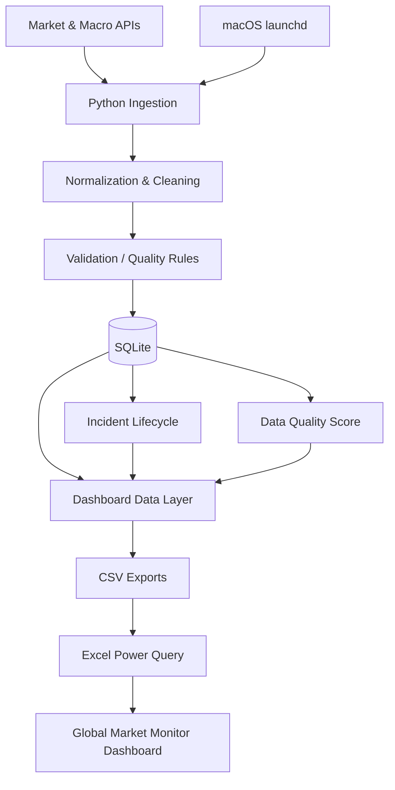

# Global Market Monitor & Data Quality Pipeline

### 📊 [View / Download the Excel Dashboard](./Global_Market_Monitor2.xlsx)


### 📊 [View / Download the Excel Dashboard](./Global_Market_Monitor2.xlsx)


> **An end-to-end market data monitoring project built to demonstrate practical Data Analyst skills across data ingestion, validation, automation, SQL/SQLite persistence, incident monitoring, and Excel dashboarding.**

This project turns raw market and macroeconomic data into a refreshable analyst workflow:

**APIs → Python → Data Cleaning & Validation → SQLite → Incident Monitoring → Data Quality Scoring → Dashboard Data Layer → Excel / Power Query**

I built it as a portfolio project for **Data Analyst / Market Data / Global Markets & Equities** roles. The goal was not simply to create a visually attractive dashboard, but to build a small monitoring system that treats **data quality, freshness, missing values, market context, and auditability** as first-class analytical problems.

---

## Why I Built This

A market dashboard is only useful if the underlying data can be trusted.

Instead of starting with charts, I started with questions an analyst should ask:

- Is the value actually available, or was a missing field silently turned into zero?
- Is a quote stale because the feed failed, or simply because the market is closed?
- Is the bid/ask spread reasonable?
- Is a quote crossed or locked?
- Is a large move a real market event or a statistical outlier that needs review?
- If a problem persists for multiple refreshes, can I track its lifecycle without creating duplicate alerts?
- Can a hiring manager or another analyst understand exactly how a metric was produced?

Those questions shaped the architecture of the project.

---

## What the System Does

The monitor currently tracks **32 market instruments** across multiple asset classes and regions, including:

- Major indices: S&P 500, Nasdaq Composite, Nikkei 225
- Volatility: CBOE VIX
- FX: USD/JPY
- Commodity: Gold futures
- Crypto: Bitcoin
- 10 Japanese equities
- 10 U.S. equities
- 5 U.S. technology equities

It also monitors macroeconomic indicators including:

- Effective Federal Funds Rate
- U.S. 10-Year Treasury Yield
- U.S. CPI YoY
- Japan 10-Year Government Bond Yield
- Japan Overnight / Interbank Rate
- Japan CPI YoY when the underlying source can be validated correctly

The Excel layer then presents the data through dedicated views for:

- Global Dashboard
- U.S. Stocks
- Japan Stocks
- Technology Stocks
- Macro
- Data Quality
- Incidents
- Transparent Data Model / control definitions

---

## Architecture



### Refresh flow

- **Market + quote pipeline:** every 5 minutes
- **Macro pipeline:** daily
- **Excel:** refreshes the connected source tables with `Refresh All`
- Source tables drive formulas, rankings, alerts, and historical charts

The pipeline is designed so that the dashboard is **not manually re-keyed**.

---

## Data Sources

The project uses multiple data sources because no single source covers every analytical requirement.

| Data | Source / Tool | Purpose |
|---|---|---|
| Market bars / prices / volume | `yfinance` | Multi-asset market monitoring and price history |
| U.S. equity & crypto quotes | Alpaca Market Data API | Bid, ask, quote age, spread and quote-quality checks |
| U.S. macro & selected Japan rates/yields | FRED API | Rates, yields and CPI-related macro data |
| Japan CPI | Japan e-Stat | Official Japan statistical source, subject to semantic validation |
| Persistent storage | SQLite | Run history, snapshots, macro records, incidents and quality scores |
| Analyst presentation | Excel + Power Query | Refreshable monitoring and analysis interface |

API credentials are stored outside the code through environment variables and should never be committed to GitHub.

---

## Data Quality Is a Core Feature

A major focus of this project is distinguishing **real market behavior** from **data-quality problems**.

### Quality checks

The pipeline evaluates:

- `MISSING`
- `STALE`
- `OUTLIER`
- `MISSING_QUOTE`
- `STALE_QUOTE`
- `WIDE_SPREAD`
- `CROSSED_MARKET`
- `LOCKED_MARKET`
- `MARKET_CLOSED`

### Important analytical controls

#### Missing is not zero

Unavailable values are kept blank or displayed as `N/A`.

A missing ask price should never silently become `0`, because that would create a false spread and potentially a false analytical conclusion.

#### Stale is session-aware

Elapsed time alone is not enough to classify a security as stale.

A U.S. or Japanese equity is not marked stale simply because its market is closed. The system considers whether the instrument is expected to be trading before assigning a stale flag.

#### Spread calculation

When valid bid, ask, and mid values exist:

```text
Spread bps = (Ask - Bid) / Mid × 10,000
```

Crossed and locked markets are surfaced separately because they should not be interpreted as ordinary spreads.

#### CPI semantics are validated

A CPI **index level** and CPI **year-over-year inflation rate** are not interchangeable.

The macro layer therefore refuses to relabel an index value as a percentage. If Japan CPI YoY cannot be uniquely validated from the source metadata, the dashboard shows `N/A` rather than manufacturing a number.

This is intentional: **an unavailable answer is better than a misleading answer.**

---

## Incident Monitoring

Detected problems are persisted in an `incident_log`.

An incident is identified using a logical key based on:

```text
dataset | symbol | issue_type
```

If the same problem continues across multiple refresh cycles:

- the incident remains `OPEN`
- `last_seen_utc` is updated
- `occurrence_count` increases

When the problem disappears:

- status changes to `RESOLVED`
- `resolved_at_utc` is recorded

This avoids creating a new duplicate alert every five minutes.

### Priority model

```text
CRITICAL
   ↓
HIGH
   ↓
MEDIUM
```

The dashboard prioritizes active incidents so an analyst can identify the most important data problem quickly.

---

## Data Quality Score

Each market run produces a composite Data Quality Score.

| Dimension | Weight | What it measures |
|---|---:|---|
| Completeness | 30% | Required fields are present |
| Timeliness | 25% | Data is sufficiently fresh when the market is expected to be active |
| Validity | 25% | Values pass outlier / crossed / locked / validity checks |
| Consistency | 20% | Duplicate and quote-spread consistency checks |

### Score interpretation

```text
95–100      EXCELLENT
90–94.99    GOOD
80–89.99    REVIEW
< 80        POOR
```

The aggregate score does **not** replace incident review. A severe incident can still require analyst attention even if the total score remains high.

---

## Excel Analytical Layer

The Excel workbook is intentionally separated from the raw ingestion logic.

Python exports a dashboard-ready layer:

```text
dashboard_data/
├── market_overview.csv
├── quotes.csv
├── macro.csv
├── incidents.csv
├── quality_score.csv
└── quality_history.csv
```

These feed structured Excel / Power Query tables.

### Workbook structure

```text
Dashboard
US Stocks
Japan Stocks
Tech
Macro
Data Quality
Incidents
Data_Model
tblMarket
tblQuotes
tblMacro
tblIncidents
tblQuality
tblQualityHistory
```

### Dashboard capabilities

The workbook includes:

- Global market summary
- Price / level and move in basis points
- Analyst quality status
- Macro summary
- Composite quality score
- Completeness / Timeliness / Validity / Consistency
- Open incident count and severity
- Current Alerts
- Quality score history
- Quality component history
- Incident count history
- U.S. equity movers
- Japan equity movers
- Technology-stock comparison
- Bid / ask and spread monitoring
- Open and resolved incident views

The workbook also includes a **Data Model** sheet documenting source connections, control definitions, and the automation workflow so the analysis remains auditable.

---

## Development Journey

This project was built iteratively rather than as a one-shot dashboard.

### 1. Defined the analytical scope

I started with a multi-market watchlist covering U.S. and Japanese equities, technology stocks, indices, FX, gold, Bitcoin, interest rates, yields, and CPI.

### 2. Built the ingestion pipeline

I used Python to retrieve market data and normalize different sources into a consistent structure.

### 3. Added persistent storage

SQLite was introduced so the project could retain:

- historical runs
- market snapshots
- quote snapshots
- macro observations
- data-quality logs

This changed the project from a static dashboard into a monitoring system with history.

### 4. Added market-data quality logic

I implemented checks for:

- missing data
- duplicate data
- stale observations
- statistical outliers
- quote age
- crossed markets
- locked markets
- wide spreads
- market-session context

### 5. Added FRED and Japan macro data

FRED was integrated for U.S. rates, Treasury yields, CPI and selected Japanese financial indicators.

Japan e-Stat was integrated for official CPI data. During development, ambiguous metadata and source-table issues were deliberately treated as validation failures instead of forcing an unreliable value into the dashboard.

### 6. Added Alpaca quote monitoring

Alpaca was added to provide bid / ask quote information for supported instruments.

This enabled:

- mid-price calculation
- spread calculation
- spread bps
- quote-age monitoring
- missing quote detection
- crossed / locked quote checks

### 7. Automated the pipeline

The project was moved from a manual Python command to macOS `launchd`.

The automation includes:

- a five-minute market / quote refresh
- a separate daily macro refresh
- log files
- protection against overlapping runs

I also debugged a macOS privacy issue where background jobs could not access a project stored inside `Downloads`, then moved the project to a stable project directory and rebuilt the virtual environment.

### 8. Added incident lifecycle management

Instead of producing repeated warnings, the system now tracks persistent incidents across runs and resolves them when conditions normalize.

### 9. Added a composite quality score

The monitoring output was converted into interpretable dimensions that can be tracked over time.

### 10. Built a dashboard data layer

SQLite output is transformed into clean CSV interfaces specifically for Excel.

Atomic file writes reduce the risk of Excel reading a half-written file during an automated update.

### 11. Built the Excel dashboard

The six CSV sources were connected through Excel / Power Query.

The workbook was then designed around:

- market monitoring
- macro context
- data-quality KPIs
- rankings
- incidents
- historical trends
- transparent analyst controls

### 12. Tested refresh behavior end-to-end

The final workflow was tested across multiple automatic refresh cycles:

```text
API update
→ Python processing
→ SQLite persistence
→ dashboard CSV update
→ Excel Refresh All
→ dashboard timestamp / values / alerts / charts update
```

---

## Problems I Had to Solve

This project involved more debugging and judgment than simply writing formulas.

Examples include:

### API and source failures

During development, external sources returned:

- HTTP 502 responses
- timeouts
- missing quote sides
- invalid or ambiguous statistical IDs
- inconsistent metadata

The pipeline was designed to log and isolate source problems rather than treating every failure as valid data.

### Datetime handling

Timestamps moved through:

```text
API → pandas → SQLite → CSV → Power Query → Excel
```

I had to diagnose type-conversion and refresh issues so Excel timestamps remained live after repeated refreshes rather than becoming static values.

### Market-session context

A naive stale rule incorrectly labels closed-market data as stale.

I changed the logic to distinguish:

```text
STALE
```

from:

```text
MARKET_CLOSED
```

This is a small implementation detail, but it materially changes the correctness of the analysis.

### Data semantics

The Japan CPI work reinforced an important lesson:

**valid syntax is not the same as valid analysis.**

Even if an API returns a numeric value, the number still has to represent the intended economic concept before it belongs in a dashboard.

---

## Technical Stack

### Python

- pandas
- NumPy
- requests
- yfinance
- python-dotenv

### Data / Storage

- SQLite
- SQL
- CSV
- REST APIs

### Market / Macro Sources

- Alpaca Market Data API
- FRED API
- Japan e-Stat
- Yahoo Finance via `yfinance`

### Analytics / Presentation

- Excel
- Power Query
- Excel Tables
- formulas
- conditional formatting
- dynamic rankings
- charts

### Automation

- macOS `launchd`
- shell scripts
- environment variables
- run logs
- overlap protection

---

## Repository Structure

```text
global_market_monitor/
│
├── refresh_market.py
├── config.py
├── requirements.txt
├── .env.example
├── .gitignore
│
├── data/
│   └── market_monitor.db
│
├── dashboard_data/
│   ├── market_overview.csv
│   ├── quotes.csv
│   ├── macro.csv
│   ├── incidents.csv
│   ├── quality_score.csv
│   └── quality_history.csv
│
├── logs/
│
├── run_market_refresh.sh
├── run_macro_refresh.sh
├── install_autorefresh.sh
├── uninstall_autorefresh.sh
│
└── Global_Market_Monitor.xlsx
```

> The database, logs, generated files, workbook name, and other runtime artifacts can be included or excluded from Git depending on the repository strategy.

---

## Running the Project

### 1. Create the environment

```bash
python3 -m venv .venv
source .venv/bin/activate
python -m pip install -r requirements.txt
```

### 2. Configure environment variables

```bash
cp .env.example .env
```

Add the required API credentials to `.env`.

**Never commit `.env` or live API keys.**

### 3. Run manually

Full pipeline:

```bash
python refresh_market.py --mode full
```

Market / quote layer only:

```bash
python refresh_market.py --mode market
```

Macro layer only:

```bash
python refresh_market.py --mode macro
```

### 4. Install automatic refresh on macOS

```bash
chmod +x install_autorefresh.sh
./install_autorefresh.sh
```

The market pipeline then runs automatically on the configured interval.

### 5. Open Excel

Open the dashboard workbook and use:

```text
Data → Refresh All
```

to refresh the six connected source tables and dependent analytical views.

---

## What This Project Demonstrates About Me as a Data Analyst

I am actively working toward a career in data analysis, and I wanted this project to demonstrate more than knowledge of individual tools.

### 1. I can own an analytical problem end-to-end

I moved from:

```text
business / analyst question
```

to:

```text
data acquisition
→ cleaning
→ validation
→ storage
→ monitoring
→ automation
→ visualization
→ communication
```

rather than stopping after one part of the process.

### 2. I pay attention to data quality

I do not want a dashboard that simply produces numbers.

I want to know:

- where the data came from
- whether the value is complete
- whether it is fresh
- whether its meaning is correct
- whether an anomaly is market behavior or a source problem
- how another analyst can audit the result

### 3. I can debug unfamiliar systems

While building the project I worked through problems involving:

- API authentication
- HTTP failures
- pandas timestamps
- SQLite
- source metadata
- Excel data types
- Power Query
- macOS permissions
- background scheduling
- live workbook refresh behavior

I did not start the project knowing the answer to each problem. I worked through them until the full system functioned together.

### 4. I can turn raw data into analyst-facing information

The final output does not expose the user to raw API responses.

It converts them into:

- market summaries
- basis-point moves
- quote spreads
- quality flags
- severity-ranked incidents
- data-quality KPIs
- historical trends

### 5. I understand that analytical judgment matters

A technically valid formula can still produce a misleading conclusion.

Examples in this project include:

- distinguishing zero from missing
- distinguishing market closed from stale
- refusing to display an unvalidated CPI value
- separating market movement from data-quality status

### 6. I build for the next analyst, not only for myself

The workbook includes transparent definitions and control logic because another analyst should be able to understand what the system is doing without reverse-engineering every formula.

---

## What I Could Contribute to a Data Team

This project reflects the type of work I want to contribute professionally:

- **Data cleaning and reconciliation** — identifying missing, stale, inconsistent, or suspicious records
- **Automation** — reducing repetitive manual work and building repeatable refresh processes
- **Data monitoring** — turning quality rules into actionable exceptions and incidents
- **SQL / Python analysis** — transforming raw data into reliable analytical datasets
- **Excel / Power Query reporting** — delivering outputs that business and operational users can work with directly
- **Root-cause investigation** — tracing a bad output back through transformations and source data
- **Documentation and auditability** — making assumptions and calculations understandable
- **Cross-market analysis** — working across U.S. and Japanese market data and macroeconomic context
- **Continuous improvement** — treating a working first version as the beginning of validation, not the end

My goal is to be the analyst who can both **find the problem in the data and communicate why it matters**.

---

## What I Would Improve Next

This is a portfolio system, not a production trading platform.

Logical next steps include:

- exchange-calendar-aware session logic
- per-instrument / liquidity-adjusted spread thresholds
- stronger retry / exponential-backoff logic for external APIs
- automated unit and integration tests
- CI checks for data-quality rules
- cloud-based scheduling instead of relying on a local Mac
- direct BI / database connectivity instead of CSV as the presentation interface
- alert delivery through email or Slack
- expanded market coverage
- configurable watchlists
- longer-term historical analytics and regime comparisons

Documenting these limitations is intentional. A useful analyst should know not only what a system does, but also **where its assumptions stop being reliable**.

---

## Hiring Manager Summary

If you are reviewing this project for a Data Analyst, Market Data, or Global Markets / Equities role, the main point I hope it demonstrates is:

> **I can take an ambiguous data problem, learn the required tools, build a working end-to-end solution, validate the output, investigate failures, automate repetitive work, and present the result in a way another analyst can use.**

The dashboard is the visible output.

The larger project is the reasoning, validation, debugging, and data pipeline behind it.

---

## Disclaimer

This project is for educational and portfolio purposes.

It is not an execution platform, trading recommendation system, or source of investment advice. Market data availability and timing depend on external providers and their respective licensing / usage terms.
